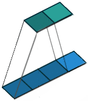

## Datos

* Radiación solar en el aeropuerto Kalaeloa (Hawaii) ([https://data.nrel.gov/submissions/11](https://data.nrel.gov/submissions/11))

* 17 sensores 

* Resolución temporal 1s

* Marzo de 2010 a Octubre de 2011 (20 meses)

* Desde las 5:00 hasta las 20:00 HST

---

## Objetivo

* Predecir la radiación solar a muy corto plazo (30 s, 1 min, 10 min)

* Series temporales:

  1. Multivariantes
  
  2. Correladas espacialmente

---

## Persistencia

.center[

]
---

## Primera aproximación

* Convertir a datos tabulares:

|  $t$   | $\mathbf{S1_t}$ | $S1_{t-1}$ | $S1_{t-2}$ | $S2_{t-1}$ | $S2_{t-2}$ | $S3_{t-1}$ | $S3_{t-2}$ |
|------|----------|----------|----------|----------|----------|----------|---------|
|   1  |  20      |          |          |          |          |          |         |
|   2  |  25      |    20    |          |    31    |          |   5      |         |
|   3  |  30      |    25    |    20    |    32    |   31     |   9      |    5    |
|   5  |  34      |    30    |    25    |    36    |   32     |   3      |    9    |
 
* Usar cualquier modelo para datos estructurados (regresión lineal, etc.)

* Incorpora información de todos los sensores
  
  
---

## Interpretabilidad

 * Regresión lineal + regularización (Elastic Net)

 * Modelos "interpretables"

---

## Distribución espacial MAE

![:vspace 8]

.center[

]

---

## Dirección y magnitud del viento

.center[

]

---

## Convoluciones 1D

* Ordenar los sensores de acuerdo a su longitud

* Red neuronal con convoluciones 1D para explotar estructura

![:vspace 2]

.center[

]

![:vspace 1]

.center[

  .footnotesize[
      Fuente: [Peltarion. 1D Convolution block](https://peltarion.com/knowledge-center/documentation/modeling-view/build-an-ai-model/blocks/1d-convolution-block)
    ]
  
]

---

## Resultados

MAE de la predicción a 1 paso sobre conjunto test (agosto 2011 - noviembre 2011)

| Modelo       | Izquierda   | Centro   | Derecha   |
|--------------|-------|-------|-------|
| Persistencia | .red[57.26] | .red[60.00] | .green[57.00] |
| ElasticNet   | 45.94 | 58.02 | .red[71.46] |
| Conv1D       | .green[40.20] | .green[47.61] | 57.06 |

---

## Posibles mejoras

1. Modelos de **predicción** meteorológica numérica (Numerical Weather Prediction, NWP)

  * resolución espacial 2.5-16 km
  
  * resolucion temporal 1-3 h
 
2. Satélites geoestacionarios (por ej. [METEOSAT](https://www.eumetsat.int/website/home/Satellites/CurrentSatellites/Meteosat/MeteosatDesign/index.html))

  * resolución espacial 1-3 km
 
  * resolución temporal 5-15 min
  
3. Estaciones meteorológicas

  * resolución espacial irregular
  
  * resolución temporal de minutos o incluso segundos

---

## Aplicación

* Plataforma Solar de Almeria (Tabernas)

* Necesaria predicción de radiación en tiempo real para operar espejos

* **Estado del arte**: cámaras de cielo

* **Posible alternativa**: red de sensores

---

background-image: url(img/PSA.webp)
background-size: cover

![:vspace 95]

.right[
  .small[
    [Fuente: El Periódico de la Energía](https://elperiodicodelaenergia.com/la-plataforma-solar-de-almeria-resucita-de-la-mano-del-ciemat/)
  ]
]

---

## Conclusión

 * Trasladar la intuición física a la arquitectura de la red
 
 * Explotamos las correlaciones espaciales de los sensores
 
---

.pull-left[
.center[
    
Roi Naveiro

    
Victor Gallego
]
]

.pull-right[
.center[
    
David Gómez-Ullate

    
Simón Rodríguez
]
]

.center[
    
David Gordo
]